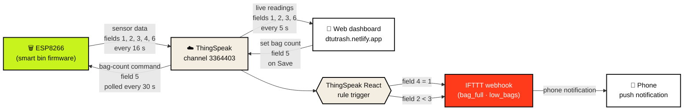

# IoT system flow

The four moving parts of the system — the ESP8266 in the bin, the ThingSpeak cloud channel, the web dashboard at https://dtutrash.netlify.app/, and the IFTTT push-notification path — never talk to each other directly. **ThingSpeak is the only thing in the middle:** every other component reads from or writes to its numbered fields, and that is the entire pipeline.

## Field map

| Field | Meaning | Written by | Read by |
|---|---|---|---|
| 1 | Distance (cm) from ultrasonic sensor | ESP | Dashboard |
| 2 | Bags remaining | ESP | Dashboard, IFTTT React |
| 3 | State (0=LOAD, 1=CHECK, 2=CLOSE, 3=EMPTY_ME) | ESP | Dashboard |
| 4 | Bag-full event (1 = full) | ESP | IFTTT React |
| 5 | Set-bag-count command | Dashboard (user) | ESP |
| 6 | Temperature (°C) from LM35 | ESP | Dashboard |

## Timing summary

| Direction | Cadence |
|---|---|
| ESP → ThingSpeak (push) | every 16 s, when data has changed |
| ESP ← ThingSpeak (poll field 5) | every 30 s |
| Dashboard ← ThingSpeak (refresh) | every 5 s |
| Dashboard → ThingSpeak (set bag count) | on user click |
| ThingSpeak React → IFTTT | event-driven |
| IFTTT → phone | event-driven |
